# Manual de Practicas 
## Introduccion

LabWIEW de NAtional instruments es un entorno de desarrollo integrado especializado en informatica industrial y cientifica. Su particularidad es que se baa en el lenguaje G(por grafico), creada por National Instruments que es enteramente grafica.

Permite el desarrollo de programaS informaticos complejos facilitando al mismo tiempo la programacion y en consecuencia disminuir los plazos de sesarrollo. Gracias a sus librerias de fucniones dedicadas a la adquisicion de datos, las instrumentacion, el analisis matematico de las mediciones y la evaluacion, LabWIEW se dedica especialmente a los bancos de pruebas y mediciones.

## Practica  1- Suma

En esta practica  se realizara una interfaz simple, la cual consta de realizar la suma de dos numeros y el resultado se mostrara en una caja de texto, dichos valores se asignaran a traves de las perillas las cuales nos permitiran variar  el numero  y asi, realizar cualquier suma. A continuacion se muestra la imagen tanto de la interfaz como del codigo.

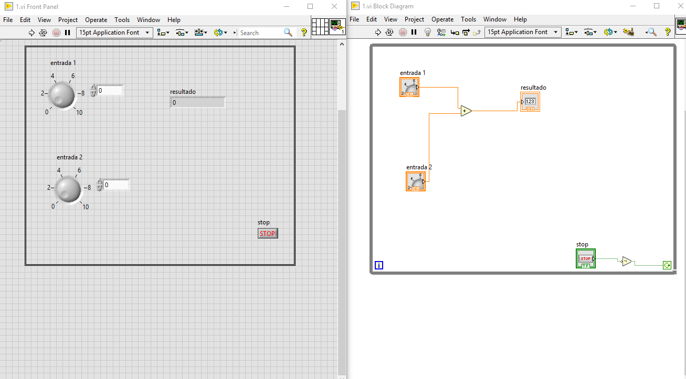

Una vez colocadas ambas perillas, en el panel de proramacion se insertara una operacion aritmetica, suma, la cual nos permitira realizar la operacion de ambos numeros.

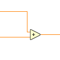

Ya teniendo la operacion aritmetica, en este caso  nuestra suma, se conectaran cada una de las perillas a cada una de las entradas de  la operacion, esto servira para que se realice la operacion con exito.

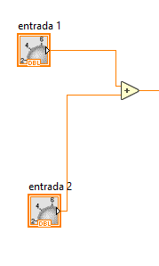

Posteriormente, se insertara un control numerico, este compone nos servira para mostrar el resultado de la suma , por lo tanto este control numerico se enlazara o conectara a la salida de la operacion y se le asuganra el nombre de resultado, como se muestra en la siguiente figura.

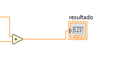

Despues, se insertara un ciclo while, este ciclo nos servira para ciclar el proceso y obtener una señal la cual nos permita realizar la operacion, asi mismo se le asignara un boton de stop, ligado a una compuerta Not, esto nos ayudara a terminar el ciclo cada vez que se desee.

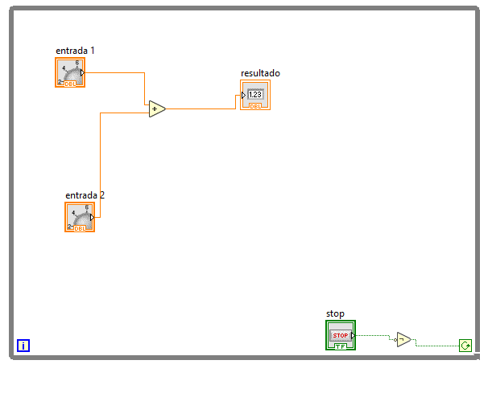

Una vez que se tengan todos los elementos requeridos y las conexiones necesarias, se procedera a  ejecitar el programa, dando valor a las perillas y corroborando que el resultado sea el correcto, en este cas sera la suma de ambos numeros.

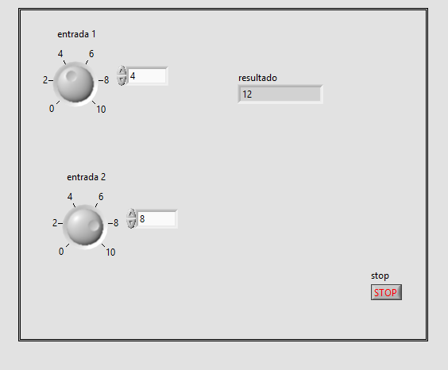

## Practica 2- Indice de Masa Corporal

Conforme los conocimientos obtenidos en la practica anterior, se realizara una interfaz y/o programa el cual nos permita calcular el indice de masa corporal de las personas, permitiendonos saber ssu estado de obesidad, esto se lograrar a partir de dos variables rqeuqridas, el peso en kilogramos y la altura.

Primero, se procedera a insertar el ciclo while, el cual nos permitira ciclar el programa.

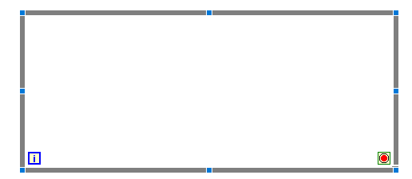

Posteriormente, se insertaran tres controles numericos, los cuales se la+es asignara un nombre a cada uno, el primero se nombrara como el peso de la persona, el segundo como la altura, sin embargo este dato tendra que ser el peso en kilogramos de la misma, y el tercero sera la misma altura,sin embargo, este dato se nos mostrara  convirtiendo la altura de metros a centimtros, ya que para la ecuacion necesaria, la altura debe de estar en centimetros.

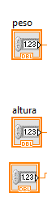
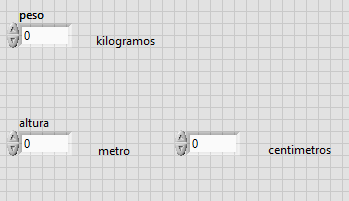

A continuacion, insertaremos una operacion aritmetica, en este caso sera una division, la cual, una de las entradas de esta operacion, se conectara al primer control numerico, en este caso, el peso.

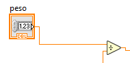

Posteriormente, se insertaran dos operaciones mas, una suma, la cual se conectara una de las entradas de esta  al control numerico, el cual sera la altura en metros.

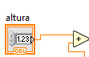

Despues, se onectara la segunda operacion, en este caso, una segunda division, la cual se conectara una de las entradas  al tercer control numerico, el cual sera la altura en centimetros, y la segunda entrada de esta operacion, se conectara a  una constante numerica, la cual se encontrara en el menu de componentes con el nombre de Numeric Control, este control numerico se le asignara un valor de 100, ya que es  correspondiente a la ecuacion que requerimos realizar.Se conectara la salida de la segunda division a la segunda entrada de la operacion suma .

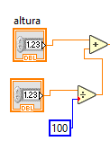

Se procedera a insertar una operacion la cual sera un exponente, esto con la finalidad de elevar al cuadrado la  operacion de las alturas, dandonos asi una conversion de metros a centimentros, la entrada de esta operacion se conectara a la salida de la suma , y la salida de la operacion exponente se conectara a la segunda entrada de la division que esta conectada  al control numerico del peso. El resultado de la conexion quedara asi:

Una vez teniendo conectado todo esto, se insertara  un  control de llenado, el cial lo podremos encontrar en el menu del panel izquierdo, con el nombre de Vertical File Slide, porteriormente, en el panel derecho, este componente se conectara a la salida de la division, la cual se conecto toda la operacion anterior como se muestra en la figura:

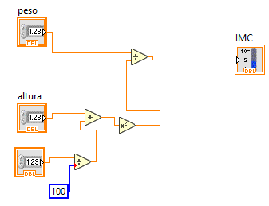

Por ultimo, se le agregara un boton de stop desde el panel izquierdo, en el menu de compone boleanos  y se conectara a una compuerta Not y a la vez, esto se conectara al ciclo while, esto nos permitira terminar el proceso cuando se desee.
El resultado de la xonexion quedara de esta manera.

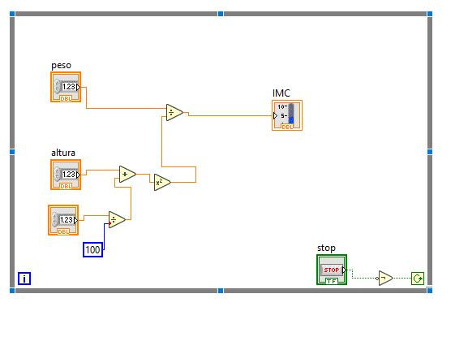

Y del lado izquierdo, en el panel de elementos, se vizualizara de esta manera, agregando etiquetas al control de llenado como limites de sobrepeso, obesidad entre otros.

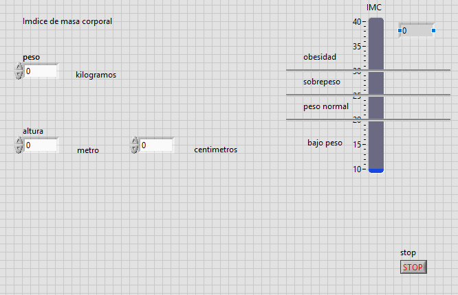

Por ultimo, se ejecutara el programa y se insertaran datos de las personas, dandonos como resultado, en el control de llenado el resultado del indice de masa cirporal de las personas como se muestra en la figura.

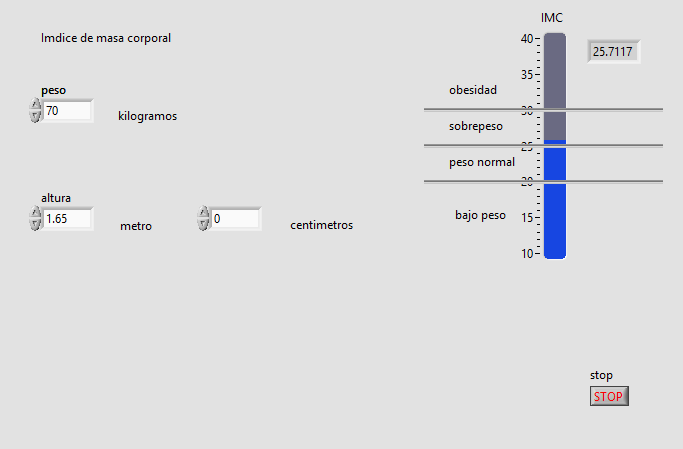

## Practica 3- Conexion linx con arduino.

Para esta practica se necesitaran obtener las librerias de linx, estas lobrerias nos sirven para  poder tener una comunicacion con arduino, de igual manera se montara un circuito en la protoboard con arduino, el cual nos mostrara  el rssultado de la programacion en el circuito.

Una vez obtenidas las librerias y conectado el circuito a nuestra placa arduino, se conectara nuestra placa a la pc y se realizara lo siguiente:

En el panel de menus elegiremos la opcion Tools, seleccionaremos la opcion MakerHube y despues linx, nos mostrara un ultimo menu y seleccionaremos la opcion de  LINX Firmware Wizard...  como se muestra en la figura.

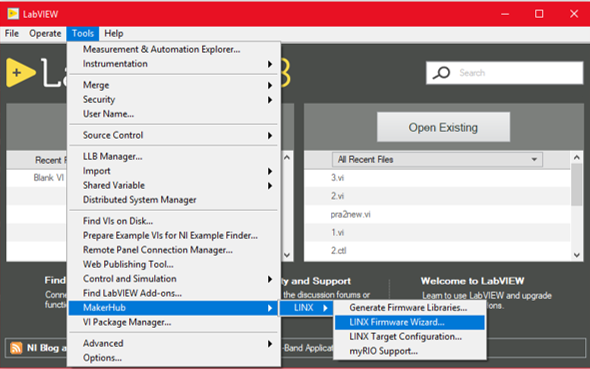

.Una vez seleccionada la opcion nos mostrara la siguiente ventana:

En esta ventana  seleccionaremos la placa arduino que estemos utilizando en la opcion  Device Type, despues daremos click en el boton siguiente y nos mostrara una nueva ventana:

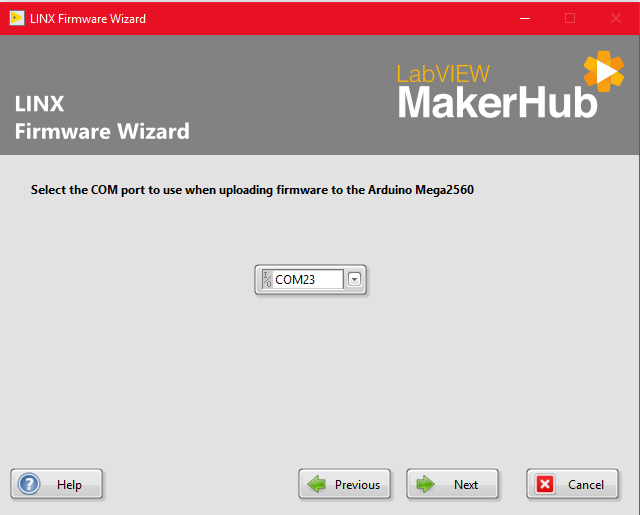

En esta ventana seleccionaremos el puerto en el que esta conectado nuestro arduino, despues daremos clic  en next y se mostrara la siuiente ventana:

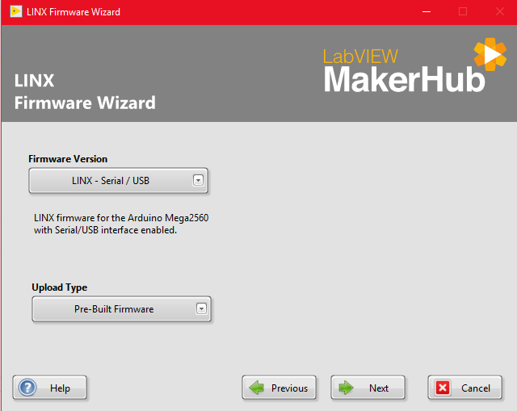

En esta ventana no se editara ninguna opcion, solo daremos clic para pasar a la siguente ventana:

En esta ventana se comenzara a cargar el programa a la placa, mostrado una barra de estado el cual nos indicara el progreso de carga de la proramacion, una vez terminada la carga nos mostrara lo siguiente:

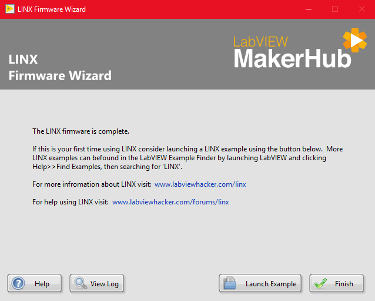

Esta ventana nos indica que la carga de la programacion a la placa ha terminado, por consiguiente daremos clic en la opcion  Launch Example y nos mostrara la siguiente interfaz, la cual es un ejemplo por defect:

Una vez  teniendo este ejemplo, se editara quitando y agregando componentes, los cuales generaran una funcion distinta a ladel ejemplo, esta funcion tendra como finalidad hacer queel led del arduino parpadee y a su vez, el led de la interfaz haga la misma funcion, estando sincronizados  el led fisico con el de la interfaz, no obstante, se tiene que tener un puerto

