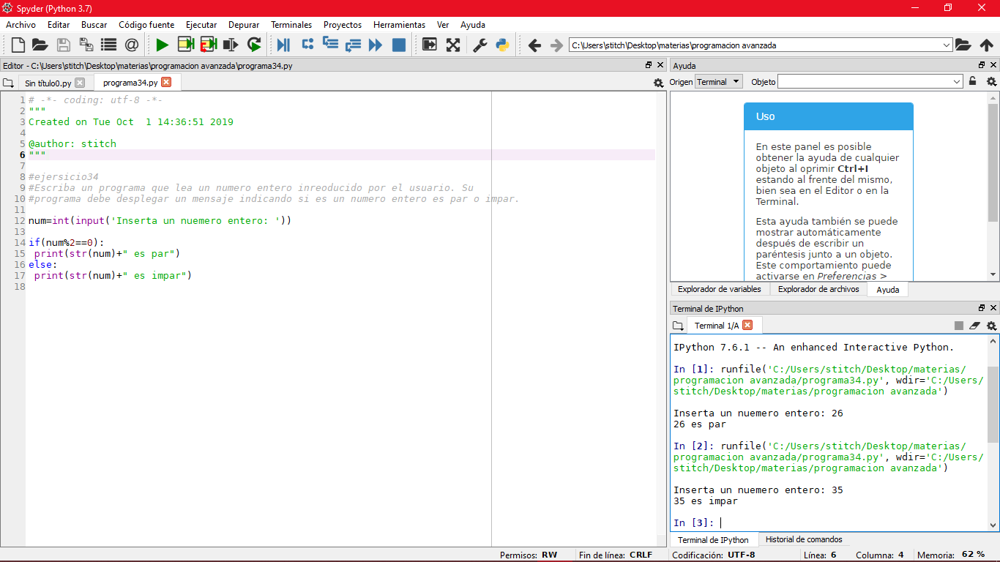

# Manual de Practicas 
## Introduccion

LabWIEW de NAtional instruments es un entorno de desarrollo integrado especializado en informatica industrial y cientifica. Su particularidad es que se baa en el lenguaje G(por grafico), creada por National Instruments que es enteramente grafica.

Permite el desarrollo de programaS informaticos complejos facilitando al mismo tiempo la programacion y en consecuencia disminuir los plazos de sesarrollo. Gracias a sus librerias de fucniones dedicadas a la adquisicion de datos, las instrumentacion, el analisis matematico de las mediciones y la evaluacion, LabWIEW se dedica especialmente a los bancos de pruebas y mediciones.

## Practica  1- Suma

En esta practica  se realizara una interfaz simple, la cual consta de realizar la suma de dos numeros y el resultado se mostrara en una caja de texto, dichos valores se asignaran a traves de las perillas las cuales nos permitiran variar  el numero  y asi, realizar cualquier suma. A continuacion se muestra la imagen tanto de la interfaz como del codigo.

Una vez colocadas ambas perillas, en el panel de proramacion se insertara una operacion aritmetica, suma, la cual nos permitira realizar la operacion de ambos numeros.

Ya teniendo la operacion aritmetica, en este caso  nuestra suma, se conectaran cada una de las perillas a cada una de las entradas de  la operacion, esto servira para que se realice la operacion con exito.

Posteriormente, se insertara un control numerico, este compone nos servira para mostrar el resultado de la suma , por lo tanto este control numerico se enlazara o conectara a la salida de la operacion y se le asuganra el nombre de resultado, como se muestra en la siguiente figura.

Despues, se insertara un ciclo while, este ciclo nos servira para ciclar el proceso y obtener una señal la cual nos permita realizar la operacion, asi mismo se le asignara un boton de stop, ligado a una compuerta Not, esto nos ayudara a terminar el ciclo cada vez que se desee.

Una vez que se tengan todos los elementos requeridos y las conexiones necesarias, se procedera a  ejecitar el programa, dando valor a las perillas y corroborando que el resultado sea el correcto, en este cas sera la suma de ambos numeros.

## Practica 2- Indice de Masa Corporal

Conforme los conocimientos obtenidos en la practica anterior, se realizara una interfaz y/o programa el cual nos permita calcular el indice de masa corporal de las personas, permitiendonos saber ssu estado de obesidad, esto se lograrar a partir de dos variables rqeuqridas, el peso en kilogramos y la altura.

Primero, se procedera a insertar el ciclo while, el cual nos permitira ciclar el programa.

Posteriormente, se insertaran tres controles numericos, los cuales se la+es asignara un nombre a cada uno, el primero se nombrara como el peso de la persona, el segundo como la altura, sin embargo este dato tendra que ser el peso en kilogramos de la misma, y el tercero sera la misma altura,sin embargo, este dato se nos mostrara  convirtiendo la altura de metros a centimtros, ya que para la ecuacion necesaria, la altura debe de estar en centimetros.

A continuacion, insertaremos una operacion aritmetica, en este caso sera una division, la cual, una de las entradas de esta operacion, se conectara al primer control numerico, en este caso, el peso.

Posteriormente, se insertaran dos operaciones mas, una suma, la cual se conectara una de las entradas de esta  al control numerico, el cual sera la altura en metros.

Despues, se onectara la segunda operacion, en este caso, una segunda division, la cual se conectara una de las entradas  al tercer control numerico, el cual sera la altura en centimetros, y la segunda entrada de esta operacion, se conectara a  una constante numerica, la cual se encontrara en el menu de componentes con el nombre de Numeric Control, este control numerico se le asignara un valor de 100, ya que es  correspondiente a la ecuacion que requerimos realizar.Se conectara la salida de la segunda division a la segunda entrada de la operacion suma .

Se procedera a insertar una operacion la cual sera un exponente, esto con la finalidad de elevar al cuadrado la  operacion de las alturas, dandonos asi una conversion de metros a centimentros, la entrada de esta operacion se conectara a la salida de la suma , y la salida de la operacion exponente se conectara a la segunda entrada de la division que esta conectada  al control numerico del peso. El resultado de la conexion quedara asi:

Una vez teniendo conectado todo esto, se insertara  un  control de llenado, el cial lo podremos encontrar en el menu del panel izquierdo, con el nombre de Vertical File Slide, porteriormente, en el panel derecho, este componente se conectara a la salida de la division, la cual se conecto toda la operacion anterior como se muestra en la figura:

Por ultimo, se le agregara un boton de stop desde el panel izquierdo, en el menu de compone boleanos  y se conectara a una compuerta Not y a la vez, esto se conectara al ciclo while, esto nos permitira terminar el proceso cuando se desee.
El resultado de la xonexion quedara de esta manera.

Y del lado izquierdo, en el panel de elementos, se vizualizara de esta manera, agregando etiquetas al control de llenado como limites de sobrepeso, obesidad entre otros.

Por ultimo, se ejecutara el programa y se insertaran datos de las personas, dandonos como resultado, en el control de llenado el resultado del indice de masa cirporal de las personas como se muestra en la figura.

## Practica 3- Conexion linx con arduino.

Para esta practica se necesitaran obtener las librerias de linx, estas lobrerias nos sirven para  poder tener una comunicacion con arduino, de igual manera se montara un circuito en la protoboard con arduino, el cual nos mostrara  el rssultado de la programacion en el circuito.

Una vez obtenidas las librerias y conectado el circuito a nuestra placa arduino, se conectara nuestra placa a la pc y se realizara lo siguiente:

En el panel de menus elegiremos la opcion Tools, seleccionaremos la opcion MakerHube y despues linx, nos mostrara un ultimo menu y seleccionaremos la opcion de  LINX Firmware Wizard...  como se muestra en la figura.

.Una vez seleccionada la opcion nos mostrara la siguiente ventana:

En esta ventana  seleccionaremos la placa arduino que estemos utilizando en la opcion  Device Type, despues daremos click en el boton siguiente y nos mostrara una nueva ventana:

En esta ventana seleccionaremos el puerto en el que esta conectado nuestro arduino, despues daremos clic  en next y se mostrara la siuiente ventana:

En esta ventana no se editara ninguna opcion, solo daremos clic para pasar a la siguente ventana:

En esta ventana se comenzara a cargar el programa a la placa, mostrado una barra de estado el cual nos indicara el progreso de carga de la proramacion, una vez terminada la carga nos mostrara lo siguiente:

Esta ventana nos indica que la carga de la programacion a la placa ha terminado, por consiguiente daremos clic en la opcion  Launch Example y nos mostrara la siguiente interfaz, la cual es un ejemplo por defect:

Una vez  teniendo este ejemplo, se editara quitando y agregando componentes, los cuales generaran una funcion distinta a ladel ejemplo, esta funcion tendra como finalidad hacer queel led del arduino parpadee y a su vez, el led de la interfaz haga la misma funcion, estando sincronizados  el led fisico con el de la interfaz, no obstante, se tiene que tener activo el puerto serial usb  en el que esta conectado el arduino. Una vez teniendo la interfaz modificada, qedara de esta manera para despues poder ejecutarla:

## Practica 4- Sensor de Temperatura

Para la elaboracion de esta practica  se utilizara un componente fisico, el cual sera un sensor de temperatura lm34 , el cual estara conectado a un circuito en la protoboard y a  su vez, este se conectara a la paca arduino mediante la pc, una vez teniendo el circuito fisico, se procede a cargar el firmware a la placa arduino realizando la misma operacin que en la practica anterior, utilizando la opcion MakerHub . Posteriormente, se procedera a realizar la interfaz en LabWIEW  la cual se comenzara por insertar un ciclo while  y dentro de ellos se realizara la conexion de componentes y de opreadores .
Se colocara una opcion llamada Random Number (0-1) esta opcion nos dara valores al azar, posteriormente se insertara un operador aritmetico, en este caso sera una multiplicacion y se conectara una de las entradas con el Random Number(0-1) y en la otra entrada del operador se conectara  con un DBL constant numeric,. Posteriormente se insertara un  control numerico, el cual estara enlazado a  un operador de igualacion,  el cual realizara la funcion de encender un led, el cual estara conectado a la salida del operador de igualacion. En la salida del operador multiplicador se conectara un control de temperatura, el cual nos arrojara la temperatura que detecte el sensor fisico. Se insertara un temporizador para regular la velocidad en la qur toma la lectura el sensor y por ultimos se insertara un boton de stop , el cual estara conectado  al ciclo while para detener el proceso cuando se desel resultado final sera el siguiente:.

## Practica 5- Sensor de temperatura

Conforme a los analisis obtenidos y el aprendizaje en las parcticas anteriores, se realizara una interfaz similar a la practica anterior, con el sensor de temeratur, se ralizara una concexion en la protoboard y arduino, estos a su vez se conectaran mediante una comunicacion serial en LabWIEW, esto con la finalidad de comprender el comportamiento del circuito y del sensor.

Para comenzar, se realizara el mismo procedimiento en la opcion MakerHub, esto con la finalidad de poder cargar la programacion para la comunicacion serial hacia la tarjeta arduino, a conticnuacion se muestra la figura de la conexion lista.

Cuando se tenga esta pantalla, se dara clic en  el boton Launch Examample, esto con la finalidad de cargar el programa de muestra.

Posteriormente se editara elsta interfaz, remplazando componentes los cuales nos sefviran para la interfaz del circuito .

Se insertara un ciclo while el cual nos permitira ciclar nuestro programa.

Despues se insertaran los controles de comunicacion serial, en este caso, los controles para la interfaz Linx como son, la entrada u open, esto sera para establecer la comunicacion serial con la placa arduino,  en esta entrada serial, se le conectara un control de la misma, para ello daremos clic derecho sobre la herramienta y seeccionaremos la opcion create y nos desplegara un segund menu, el cual le daremos o seleccionaremos la opcion control, este control permite elegir el puerto en el que esdta conectado nuestra placa arduino.

Posteriormente se insertaran nuestras entradas digitales de Linx, dando clic derecho en el panel de programacion el cual esta a la derecha, seleccionaremos la opcionMakerHub y nos deplegara un menu el cual  elegiremos la opcion linx, al hacer esta accion nos mostrara un nuevo menu el cual nos mostrara varias carpetas de librerias, seleccionaremos la opcion de peripherals y  despues la carpeta de Ditigals, por ultimo elegiremos la libreria o periferico de Digital, esta la insertaremos dentro de nuestro ciclo while.

Despues se insertara la salida de la comunicacion en este caso sera una salida perteneciente a Linx, la cual se insertara dando click derecho sobre un espacio en blanco, despues seleccionaremos la opcion MakerHub y despues Linx, seleccionaremos el preiferico de salida o de cierre, este lo encontraremos como Close y lo colocaremos en la parte derecha, por fuera del ciclo while, esta misma se le conectara un menaje de error, el cual nso permitira saber si existe una falla ern la comunicacion.

Se insertara un termometro, esto con la finalidad de poder saber la tempratura , tambien insertaremos un control numerico, tanto el termometro cono el control numerico estaran conectados a una operacion de comparacion, y este ismo, estara conectado al periferco digital  de Linx, no obstante en la parte del termometro, se le conectara una ecuacion, la cual estara formada por un componente  aleatorio y este estara multimplicado por una constante, en este caso tendra el umero 100, osea que se estara multiplicando por cien veces la unidad aleatoria y estara conectado al termometro.

se asignara un control numerico el cual tambien estara conectado al periferico digital de Linx, este control establecera el pin o canal en el que esta conectado el circtuio a la placa arduino.

Por ultimo, se insertara un reloj junto con una constante numerica, en este casi seran 500, que equivale a 500 ilisegundos y se insertara para controlar la velocidad de la comunicacion serial, se procedera a conectar nuestro boton de stop y se tendra el siguiente resultado de interfaz.

Por ultimo probaremso la interfaz conectando la placa arduino y haciendo conexion asi mismsos, analizando el comportamiento de el circuito con la interfaz.

## Practica  6- vizualizador de señales en LabWIEW

Esta practica tiene como finalidad conocer el comportamiento de la señal que pasa por todo un circuito electronico fisico,  dicho comportamiento se conocera mediante un  graficadr que es erteneciente a LAbWIEW , el cual nos mostrara como se comporta la señal del circuitoPara esto se  iniciara insertando un while el cual nos permitira ciclar nuestra interfaz conforme a la comunicacion con la placa arduino.

Posteriormente se insertaran los perifericos de entrada, digital y salida o cierre  pertenecientes a MakerHub, junto con nuestro mensaje de error y se conectaran como habitualmente lo hemos hecho.

Se creara un control mediante las opciones de la entrada de Linx y se conectara a ella misma.

Se insertara un led el cual nos permita corroborar que la comunicacion con el circuito y  la placa sea correcta en la interfaz.

En  la lectura de  iteracion de nuestro cclo while se conectara una señal senoidal y en su salida de esta estara conectado nuestro graficador, esto nos permitira conocer el comportamiento que sufre el circuito al activarse, mostrandonos una señal senoidal.

Se insertara un temporizador para regular la velocidad de la señal de nuestro ciclo o interfaz, se le asignara un valor de 500 milisegundos.

Por ultimo se  insetara un boton de stop, este ira conectado a  una compuerta or, el boton de stop ira conectado a una de las entradas de esta compuerta, y la otra entrada estara conectada a la linea de error de el ciclo de comunicacion, por ultimo la salidas de la compuerta estara conectada al ciclo while, todo esto se realizara con la finalidad de  poder parar nuestro programa cuando nosotros deseemos o cuando exista algun erro de lectura en el ciclo, ete se parar automaticamente y dara por termianda la ejecucion del programa.
 A continuacion se muestra el resultado final de la programacion.}
 
 
 
 Y el resultado final de nuestra interfaz sera el siguiente.
 
 
 
 Dando pauta a ejectutar el programa una vez teniendo todo el circuito conectado de manera correcta a la placa arduino, y esta, conectada a la pc.
 
## Practica 7

Esta practica tiene como finalidad, mantener un led parpadeando cada vez que se presione un pushboton, tanto en el circuito fisico, como en la interfaz.

Comenzaremos por insertar nuestro ciclo while.

Despues se conectaran los perifericos de Linx para la comunicacion serial, la entrada, en esta entradad se creara un control el cual nos permitira elegir el puerto en el que esta conectada nuestra placa arduino, de igual manera se insertara el periferico Digital Read Chan, este periferico nos servira para leer la pulsacion de nuestro pushboton, este estara ligado a  un periferico Digital Write, el cual os permitara realizar la funcion que se esta haciendo en el circuito fisico, tambien se insertara nuestro periferico close, el cual nos permitira  termianr el ciclo, este estara conectado a  nuestro respectivo mensaje de error.

Se insertara un temporizador , se le dara un tiempo de 500 milisegundos con la finalidad de controlar la vecolidad de nuestro ciclo.

Se insertaran una entrada yuna salida a nuestro ciclo while, en la entrada estara conectada una constante verdadera.

Se insertara una compuerta And y una compuerta Not, y estas se cvonectaran entre si, sin  embargo rn la salida de la compuerta Not, se conectara un led, el cual nos mostrara el parpadeo del led fisico, estos estaran  sincronizados para que funcionen al mismo tiempo.

Por ultimo se insertara un boton de stop, el cual estara conectado a la entrada de una compuerta OR, misma que insertaremos y que la otra entrada de esta compuerta estara conectada al error de los perifericos de Linx, por ultimo la salida de la compuerta Or, estara conectada al ciclo while para que de por terminado el proceso cuando nosotros lo desseemos.

Y la interfaz quedara de esta manera:

Por ultimo se proecedera a ejectutar el programa teniendo el circuito conectado y se analizaran los resultads, y si son lo +s que se deseaban obtener.

## Practica 8

Para la elaboración de esta práctica se utilizara un componente físico, el cual será un sensor de temperatura lm34, el cual estara conectado a un circuito en el protoboard ya su vez, este se conectara a la paca arduino mediante la pc, una vez que el circuito físico, se procederá a cargar el firmware a la placa arduino realizando la misma operación que en la práctica anterior, utilizando la opción MakerHub. Posteriormente, se procederá a realizar la interfaz en LabWIEW la cual se comenzará por insertar un ciclo mientras que dentro de ellos se realizará la conexión de componentes y opreadores. Se colocara una opcion llamada Random Number (0-1) esta opcion nos dara valores al azar, posteriormente se insertara un operador aritmetico, en este caso será una multiplicación y se conectará una de las entradas con el número aleatorio (0-1) y en la otra entrada del operador se conectará con un número constante DBL. Posteriormente se insertara un control numérico, el cual estara enlazado a un operador de igualacion, el cual realizara la funcion de encendido un led, el cual estara conectado a la salida del operador de igualacion. En la salida del operador multiplicador se conecta un control de temperatura, el cual nos arrojara la temperatura que detecte el sensor fisico. Se insertara un temporizador para regular la velocidad en la qur toma la lectura el sensor y por ultimos se insertara un boton de stop, el cual estara conectado al ciclo mientras para detener el proceso cuando se desel resultado final sera el siguiente: Posteriormente se insertara un control numérico, el cual estara enlazado a un operador de igualacion, el cual realizara la funcion de encendido un led, el cual estara conectado a la salida del operador de igualacion. En la salida del operador multiplicador se conecta un control de temperatura, el cual nos arrojara la temperatura que detecte el sensor fisico. Se insertara un temporizador para regular la velocidad en la qur toma la lectura el sensor y por ultimos se insertara un boton de stop, el cual estara conectado al ciclo mientras para detener el proceso cuando se desel resultado final sera el siguiente: Posteriormente se insertara un control numérico, el cual estara enlazado a un operador de igualacion, el cual realizara la funcion de encendido un led, el cual estara conectado a la salida del operador de igualacion. En la salida del operador multiplicador se conecta un control de temperatura, el cual nos arrojara la temperatura que detecte el sensor fisico. Se insertara un temporizador para regular la velocidad en la qur toma la lectura el sensor y por ultimos se insertara un boton de stop, el cual estara conectado al ciclo mientras para detener el proceso cuando se desel resultado final sera el siguiente: En la salida del operador multiplicador se conecta un control de temperatura, el cual nos arrojara la temperatura que detecte el sensor fisico. Se insertara un temporizador para regular la velocidad en la qur toma la lectura el sensor y por ultimos se insertara un boton de stop, el cual estara conectado al ciclo mientras para detener el proceso cuando se desel resultado final sera el siguiente: En la salida del operador multiplicador se conecta un control de temperatura, el cual nos arrojara la temperatura que detecte el sensor fisico. Se insertara un temporizador para regular la velocidad en la qur toma la lectura el sensor y por ultimos se insertara un boton de stop, el cual estara conectado al ciclo mientras para detener el proceso cuando se desel resultado final sera el siguiente:

Y nuestra interfaz quedara de la siguiente manera:

Por ultimo ejecutaremos el programa y calentaremos nuestro sensor de temperatutra y observaremos como aumenta  nuestro sistema de temperatura.

## Practica 9- Control de Motores.

Para la realizacion de esta practica, se tendra que tener un circuito integrado, en este caso se usara el L293, este circuito contiene un puente H dentro de el, este puente nos permitira realizar una inversion de giro, esto se refiere al logro de  hacer que un motor pueda girar en ambos sentidos.

Una vez teniendo el circuito montado en la protoboard y que este este conectado a los pines 4, 5 y 6 de nuestra tarjeta arduino, se procedera a conectara a la pc, configurando nuestra placa arduino mediante la herramienta de MakerHub.
 Una vez tiendiendo configurada nuestra placa arduino, se procedera a realizar la programacion y creacion de nuestra interfaz.
 
 Se empezara colocando nuestro ciclo while, recordemos que esta estructura nos permite ciclar nuestro proceso cuantas veces lo deseemos.
 
 Se insertaran los perifericos de Linx para la comunicacion con la placa arduino, nuestro periferico de entrada u open y su respectivo control, el cual nos permitira elegir el puerto en el que este conectada nuestra placa arduino, porteriormente se insertaran dos perifericos digitales (Digital Write), se insertara un periferico Set Duty Cycle, este periferico nos permitira ciclar de mejor manera el giro del motor, y por ultimo se insertara nuestro periferico de salida u close, el cual nos permitira  finalizar el ciclo, asi mismo, se insertara nuestro mensaje de error.
 
 Posterioe¿rmente, se insertaran tres controles numericos,  Motor Direction Pin 1, Motor Direction Pin 2 y PWM Channel. Nuestro pin 1 estara conectado al primer periferico digital en este casi Digital Write 1 Chan, el segundo pin, estara conectado de igual manera al segundo periferico digital y nuestro control numerico que le nombramos PWM Channel, estara conectado a nuestro periferico Set Duty Cycle, esteo nos ayudara aelegir o asignar el pin en el que ciclaremos el giro del motor.
 
 Se insertara una Compuerta Not, la cual, su entrada estara conectada a un boton, el cual agregaremos para que nos sirva como inversion del giro del motor, la salida de la compuerta Not, estara conectada a nuestro segundo periferico Digital Write.
 
 Se insertara una perilla Knob, la cual nos permitira varias la velocidad del motor, esta misma estara conectada como entrada a nuestro periferico Set Duty Cicle.
 
 Una vez teniendo todos nuestros elementos necesarios conectados, se tendra este resultado:
 
 
 
 Y nuestra interfaz quedara de la siguiente manera:
 
 
 
 De esta manera, se continuara a ejecutar nuestra interfaz y teniendo todos los elementos necessarios conectados de manera correcta, inclusive el motor. Se procedera a analizar el comportamiento del motor y corroborar que realice la tarea deseada.
 
## Practica 10- Control de motores 2

Conforme a la primer interfaz la cual controlamos el giro y velocidad de un motor, se editara la misma interfaz con la finalidad de poder hacer mas eficiente este control y hacer mas simple el analisis de este mismo.

Se agregara un periferico de lectura , en este caso agregaremos un periferico Digital Read, el cual nos permitira leer la lectura que toma en cada ciclo nuestra interfaz, agregando a este un control numerico el cual tendra como nombre pin boton, este nos servira para determinar el pin en el que pueda leer nuestra lectura desde la placa arduino.

De igual manera, se agregara un control Error Out, el cual nos  permite tener un manejo automatico de errores,  y un mensaje de error correspondiente a cada codigo qe se genera, asi mismo, se cuenta con un led, el cual nos permitira conocer el status del proceso, dandonos un led color verde que signifique que el proceso de esta realizando de manera adecuada, en casi de que exista un error, el led cambiara a color rojo y automaticamente nos mostrara un codigo y debajo un mensaje del mismo codigo de error que se genero, permitiendonos saber la falla mas a detalle.

Estos elementos que se agregaron, nos permitira conocer de manera mejor el manejo de la señal que se esta trabajando por medio de un osciloscopio, este nos permitira observar como se esta comportando la señal que se esta trabajando.

Una vez finalizada la programacion, quedara de esta manera:

Y nuestra interfaz quedara de la siguente manera:

Una  vez teniendo el circuito fisico conectado de manera correcta y este a la placa arduino, se procedera a conectara a la pc, realizando la correspondiente configuracion  con el control MakerHub en Linx.

Posteriormente, se continuara a ejectutar el programa y se corroborara que el circuito y la interfaz funcionen de manera adecuada.

Finalmente, se conectara un osciloscopio a nuestro circuito para observar el comportamiento de la señal que se esta trabajando, en este caso, nos tendra que dar una señal cuadrada o recta positiva.

## PrCTICA 11-  Display de 7 segmentos.

Para la realizacion de esta practica se utilizo un display de 7 segmentos el cual su cnfguracion sera de catodo comun.

Como se muestra en la imagen, este display se alimentara o se conectara con GND, el cual sera tierra.
Posteriormente, se procedera a realizar la interfaz  en LabWIEW.

Se insertara nuestro correspondiente ciclo While, posteriormente, se insertaran los perifericos necesarios para poder realizar la comunicacion con arduino, en este caso, se sinertaran un periferico open, el cual se creara un control del mismo, este control nos peritira seleccionar el puerto COM en el que se ecneuntre conectado nuestro arduino. 

Despues, se insertaran dos perifericos Digital Write, los acuales a ambos, se le cambiara la opcion de los canales, por defecto tiene la opcion de un solo canal, seleccionaremos la flecha que esta a un la do de la etiqueta y le daremos clic en N canals.

Se insertara el periferico de saida o cierre y se conectara a su respectivo mensaje de eeror.

En nuestro panel derecho, seleccioanremos la carpeta de Array, la cual nos mostrara una serie de elementos, seleccionaremos el elemento Constant Array y lo insertaremos dentro de nuestro ciclo.

Daremos clic derecho sobre el mismo panel y seleccioanremos la carpeta de Boolean, posteriormente seleccioanremos el elemento de  true constant y lo insertaremos dentro del elemento Constant Array, esto nos dara un valor que simule una tabla de verdad, codigo binario la cual esa sera nuestro primer digito, solo pondremos en falso y verdadero las casillas correspondientes al numero que queramos pintar en nuestro display de 7 segmentos. Se realizara esta misma accion otras 8 veces, pintando la numeracion del 0 al 9.

Se insertara un elemento nuevo, en este csaso insertaremos un Build Array, esto nos permtiiras conectar todos nuestros digitos en el mismo.

 
 

 
 

  

